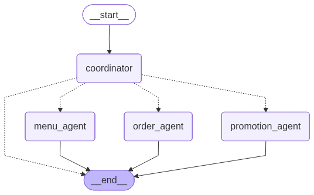
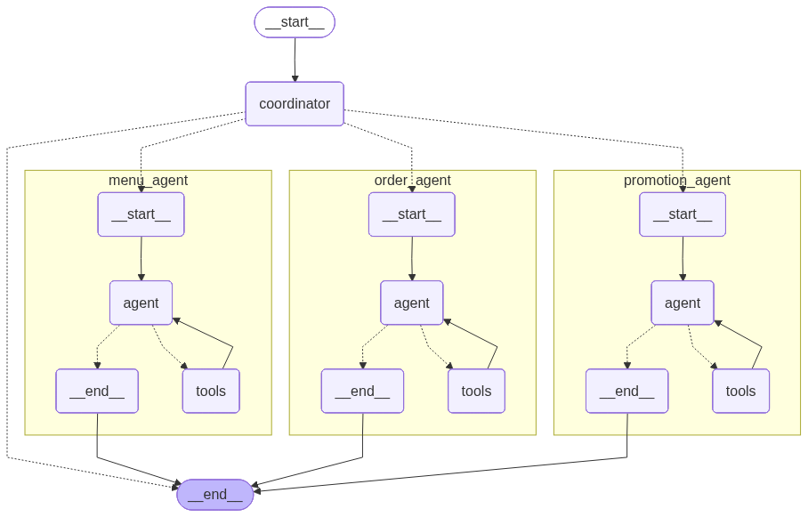

# 🍜 Voice Chatbot

AI Service for a food ordering application — Multi-Agent Chatbot & Vietnamese Speech-to-Text.

## 📋 Overview

This project provides two core services:

1. **Multi-Agent Chatbot** — A multi-agent system (LangGraph) that helps users order food, browse menus, manage carts, and check promotions.
2. **Vietnamese Speech-to-Text** — Vietnamese speech recognition (ChunkFormer) + noise filtering (Silero VAD) + spelling correction (LLM).

## 🏗️ Project Structure

```
android-ai-service/
├── main.py                          # Entry point — FastAPI application
├── pyproject.toml                   # Dependencies & project metadata
├── .env                             # Environment variables (API keys, config)
├── .env.example                     # Template for .env
├── scripts/
│   └── export_graph.py              # Export LangGraph architecture as PNG
│
├── statics/                            # Architecture diagrams
│   ├── overview_graph.png
│   └── detailed_graph.png
│
└── src/                             # Main source code
    ├── __init__.py
    ├── config.py                    # Settings (LLM, DB, VAD, Server)
    ├── database.py                  # MySQL async connection (prepared)
    │
    ├── agents/                      # 🤖 Multi-Agent System (LangGraph)
    │   ├── state.py                 # Shared state (messages, session_id)
    │   ├── coordinator.py           # Coordinator agent — intent analysis & routing
    │   ├── menu_agent.py            # Menu agent — search dishes, view details
    │   ├── order_agent.py           # Order agent — cart management, checkout
    │   ├── promotion_agent.py       # Promotion agent — coupons, deals
    │   └── graph.py                 # LangGraph workflow definition
    │
    ├── api/                         # 🌐 FastAPI Routes & Schemas
    │   ├── schemas.py               # Pydantic models (request/response)
    │   └── routes/
    │       ├── chat.py              # POST /api/chat, /api/chat/stream
    │       └── speech.py            # POST /api/speech-to-text, /api/voice-chat
    │
    ├── speech/                      # 🎙️ Speech Processing Pipeline
    │   ├── asr.py                   # ChunkFormer ASR (Vietnamese STT)
    │   ├── vad.py                   # Silero VAD (voice activity detection)
    │   └── text_correction.py       # LLM-based spelling correction
    │
    └── tools/                       # 🔧 Mock Tools (replace with real API/DB later)
        ├── menu_tools.py            # Mock menu data (10 Vietnamese dishes)
        ├── order_tools.py           # In-memory cart management
        └── promotion_tools.py       # Mock promotions & coupons
```

## 🛠️ Requirements

- **Python** >= 3.12
- **uv** (Python package manager) — [Installation guide](https://docs.astral.sh/uv/getting-started/installation/)
- **OpenRouter API Key** (current) or **Ollama** (future)

## ⚡ Setup & Run

### 1. Clone & configure

```bash
git clone <repo-url>
cd android-ai-service
cp .env.example .env
# Edit .env and fill in your OPENROUTER_API_KEY
```

### 2. Install & start

```bash
uv sync
uv run uvicorn main:app --host localhost --port 8000 > api.log 2>&1
```

Server runs at: `http://localhost:8000`

### 3. API Documentation

| URL | Description |
|-----|-------------|
| `http://localhost:8000/docs` | Swagger UI (interactive testing) |
| `http://localhost:8000/redoc` | ReDoc (readable documentation) |
| `http://localhost:8000/health` | Health check |

---

## 🤖 Chatbot Architecture

### Overview



### Detailed (X-Ray — shows internal ReAct loops)



> **How it works:** Every user message goes to the **Coordinator** first. The Coordinator uses an LLM to analyze intent and routes to the appropriate sub-agent. Each sub-agent is a **ReAct agent** (Reason + Act loop) that calls tools to answer the user's question, then returns to `__end__`.

### Data Flow

```
User: "Thêm 2 tô phở bò vào giỏ hàng"
  │
  ▼
Coordinator (LLM analyzes intent)
  → Returns: {"next": "order_agent", "response": ""}
  │
  ▼
Order Agent (ReAct loop)
  → Thinks: "User wants to add pho to cart, I need to call add_to_cart"
  → Calls: add_to_cart(session_id="user-123", dish_name="Phở bò", quantity=2)
  → Observes: "Added 2x Phở bò to cart. Total: 90,000đ"
  → Responds: "Đã thêm 2 tô Phở bò vào giỏ hàng! Tổng: 90.000đ"
  │
  ▼
Response returned to user
```

---

## 🎙️ Speech Pipeline

### Data Flow

```
┌─────────────┐    ┌───────────┐    ┌─────────────┐    ┌────────────┐    ┌───────────┐
│ Audio Input │───▶│ Silero VAD│───▶│ ChunkFormer │───▶│    LLM     │───▶│  Output   │
│             │    │           │    │    ASR      │    │ Correction │    │   Text    │
│ WAV/MP3/    │    │ Filter    │    │ Vietnamese  │    │ Fix typos  │    │ Corrected │
│ OGG/FLAC   │    │ speech    │    │ recognition │    │ & diacrit  │    │ Vietnamese│
└─────────────┘    └───────────┘    └─────────────┘    └────────────┘    └───────────┘
```

> **Important:** This is a **batch processing** pipeline. The mobile app records the complete audio first, then sends the entire file to the server. The server processes the whole file at once (not real-time/streaming). This means the user must finish speaking before the transcription begins.

---

## 📡 API Endpoints

### Health

| Method | Endpoint | Description |
|--------|----------|-------------|
| `GET` | `/` | Service info & status |
| `GET` | `/health` | Detailed health check |

---

### `POST /api/chat` — Text Chat

Send a text message and receive an AI response through the multi-agent system.

**Request:**
```json
{
  "message": "Cho tôi xem menu",
  "session_id": "user-123"        // optional — auto-generated if omitted
}
```

**Response:**
```json
{
  "response": "Dạ, nhà hàng có các danh mục: Phở, Bún, Cơm, Bánh...",
  "session_id": "user-123"
}
```

| Request Field | Type | Required | Description |
|---------------|------|----------|-------------|
| `message` | string | ✅ | User's message (Vietnamese) |
| `session_id` | string | ❌ | Session ID for cart persistence |

| Response Field | Type | Description |
|----------------|------|-------------|
| `response` | string | AI assistant's reply |
| `session_id` | string | Session ID used |

```bash
curl -X POST http://localhost:8000/api/chat \
  -H "Content-Type: application/json" \
  -d '{"message": "Cho tôi xem menu", "session_id": "user-123"}'
```

---

### `POST /api/chat/stream` — Streaming Chat (SSE)

Same as `/api/chat` but returns Server-Sent Events for real-time token streaming.

**Request:** Same as `/api/chat`

**Response:** `text/event-stream`
```
data: Dạ,
data:  nhà hàng
data:  có các
data:  danh mục...
event: session_id
data: user-123
event: done
data: [DONE]
```

```bash
curl -N -X POST http://localhost:8000/api/chat/stream \
  -H "Content-Type: application/json" \
  -d '{"message": "Tìm món phở", "session_id": "user-123"}'
```

---

### `POST /api/speech-to-text` — Speech to Text

Upload a complete audio file and receive transcribed Vietnamese text. Pipeline: VAD → ASR → LLM Correction.

**Request:** `multipart/form-data`

| Field | Type | Required | Description |
|-------|------|----------|-------------|
| `audio` | file | ✅ | Audio file (WAV, MP3, OGG, FLAC) |

**Response:**
```json
{
  "original_text": "cho toi xem men u",
  "corrected_text": "Cho tôi xem menu"
}
```

| Response Field | Type | Description |
|----------------|------|-------------|
| `original_text` | string | Raw ASR output (before correction) |
| `corrected_text` | string | Text after LLM spelling correction |

```bash
curl -X POST http://localhost:8000/api/speech-to-text \
  -F "audio=@recording.wav"
```

---

### `POST /api/voice-chat` — Voice Chat (STT + Chatbot)

Upload audio → transcribe → send to chatbot → return both transcript and AI response.

**Request:** `multipart/form-data`

| Field | Type | Required | Description |
|-------|------|----------|-------------|
| `audio` | file | ✅ | Audio file (WAV, MP3, OGG, FLAC) |
| `session_id` | string | ❌ | Session ID for cart persistence |

**Response:**
```json
{
  "original_text": "cho toi xem men u",
  "corrected_text": "Cho tôi xem menu",
  "response": "Dạ, nhà hàng có các danh mục: Phở, Bún, Cơm, Bánh...",
  "session_id": "user-123"
}
```

| Response Field | Type | Description |
|----------------|------|-------------|
| `original_text` | string | Raw ASR output |
| `corrected_text` | string | Corrected transcription |
| `response` | string | AI chatbot's reply |
| `session_id` | string | Session ID used |

```bash
curl -X POST http://localhost:8000/api/voice-chat \
  -F "audio=@recording.wav" \
  -F "session_id=user-123"
```

---

### Complete API Flow Diagram

```
Mobile App
    │
    ├── Text Mode ──────────────────────────────────────────────┐
    │   User types message                                      │
    │   POST /api/chat {message, session_id}                    │
    │       │                                                   │
    │       ▼                                                   │
    │   LangGraph Chatbot                                       │
    │       Coordinator → Agent → Tools → Response              │
    │       │                                                   │
    │       ▼                                                   │
    │   Return {response, session_id}                           │
    │                                                           │
    ├── Voice Mode ─────────────────────────────────────────────┤
    │   User records complete audio                             │
    │   POST /api/voice-chat (audio file + session_id)          │
    │       │                                                   │
    │       ▼                                                   │
    │   [1] Silero VAD → filter speech segments                 │
    │   [2] ChunkFormer ASR → transcribe to text                │
    │   [3] LLM Correction → fix spelling                       │
    │   [4] LangGraph Chatbot → generate response               │
    │       │                                                   │
    │       ▼                                                   │
    │   Return {original_text, corrected_text,                  │
    │           response, session_id}                           │
    │                                                           │
    └── STT Only ───────────────────────────────────────────────┤
        User records audio                                      │
        POST /api/speech-to-text (audio file)                   │
            │                                                   │
            ▼                                                   │
        [1] Silero VAD → [2] ASR → [3] LLM Correction          │
            │                                                   │
            ▼                                                   │
        Return {original_text, corrected_text}                  │
                                                                │
────────────────────────────────────────────────────────────────┘
```

---

## ⚙️ Configuration (.env)

### LLM Provider

| Variable | Description | Default |
|----------|-------------|---------|
| `LLM_PROVIDER` | `openrouter` or `ollama` | `ollama` |
| `OPENROUTER_API_KEY` | API key from openrouter.ai | _(required)_ |
| `OPENROUTER_BASE_URL` | OpenRouter API base URL | `https://openrouter.ai/api/v1` |
| `LLM_MODEL` | Model ID for the chatbot | `openai/gpt-4o` |
| `CORRECTION_LLM_PROVIDER` | Provider for ASR correction | `ollama` |
| `CORRECTION_MODEL` | Model for STT correction | `llama3` |

### Ollama (Future — Mac Mini with MPS)

| Variable | Description | Default |
|----------|-------------|---------|
| `OLLAMA_API_KEY` | API key/token for Ollama gateway (if required) | _(empty)_ |
| `OLLAMA_BASE_URL` | Ollama server URL | `http://localhost:11434` |
| `OLLAMA_MODEL` | Model name on Ollama | `llama3` |

### Voice Activity Detection

| Variable | Description | Default |
|----------|-------------|---------|
| `VAD_ENABLED` | Enable/disable Silero VAD | `true` |

### Runtime Tuning

| Variable | Description | Default |
|----------|-------------|---------|
| `ASR_MAX_WORKERS` | Number of ASR worker threads | `4` |
| `CART_TTL_SECONDS` | Expiration time for in-memory carts (seconds) | `3600` |
| `MODEL_PRELOAD_ON_STARTUP` | Preload ASR/VAD models at startup | `false` |
| `LOG_LEVEL` | App log level (`DEBUG`, `INFO`, `WARNING`, `ERROR`) | `INFO` |

### Database (MySQL)

| Variable | Description | Default |
|----------|-------------|---------|
| `DB_HOST` | MySQL host | _(empty)_ |
| `DB_PORT` | MySQL port | `3306` |
| `DB_USER` | MySQL username | _(empty)_ |
| `DB_PASSWORD` | MySQL password | _(empty)_ |
| `DB_NAME` | Database name | _(empty)_ |

> **Note:** Database is not connected yet. The chatbot uses mock data in `src/tools/`. When MySQL is ready, fill in credentials and replace mock functions with real queries (see `src/database.py`).

### Server

| Variable | Description | Default |
|----------|-------------|---------|
| `HOST` | Server bind address | `0.0.0.0` |
| `PORT` | Server port | `8000` |

### Model Cache Paths

| Variable | Description | Default |
|----------|-------------|---------|
| `HF_HOME` | HuggingFace cache root (ChunkFormer files) | _(system default)_ |
| `TORCH_HOME` | Torch Hub cache root (Silero VAD files) | _(system default)_ |

---

## 📦 Model Storage

AI models are downloaded automatically on first STT request and cached at:

| Model | Cache Directory |
|-------|-----------------|
| ChunkFormer (ASR) | `~/.cache/huggingface/hub/` |
| Silero VAD | `~/.cache/torch/hub/` |

No HuggingFace token required — all models are public.

When caches already exist, the service reuses local files and avoids downloading again.

---

## 🔄 Switching to Ollama (Mac Mini)

1. [Install Ollama](https://ollama.com/) and pull a model:
   ```bash
   ollama pull llama3
   ```

2. Update `.env`:
   ```env
   LLM_PROVIDER=ollama
   OLLAMA_BASE_URL=http://localhost:11434
   OLLAMA_MODEL=llama3
   CORRECTION_LLM_PROVIDER=ollama
   CORRECTION_MODEL=llama3
   ```

3. ASR automatically uses **MPS** (Apple GPU) — no extra config needed.

---

## 🗄️ Connecting MySQL (When Database is Ready)

1. Fill in database credentials in `.env`
2. Replace mock tools in `src/tools/` with real SQL queries using `src/database.py`

---

## 🧪 Quick Test

After starting the server, open `http://localhost:8000/docs`:

1. **Greeting:** `POST /api/chat` → `{"message": "Xin chào"}`
2. **Browse menu:** `{"message": "Cho tôi xem menu"}`
3. **Add to cart:** `{"message": "Thêm 2 tô phở bò vào giỏ hàng"}`
4. **View cart:** `{"message": "Xem giỏ hàng của tôi"}`
5. **Promotions:** `{"message": "Có khuyến mãi gì không?"}`
6. **STT:** Upload audio file to `POST /api/speech-to-text`

---

## 📄 Tech Stack

| Component | Technology |
|-----------|-----------|
| Web Framework | FastAPI + Uvicorn |
| Multi-Agent System | LangGraph + LangChain |
| LLM Provider | OpenRouter (current) / Ollama (future) |
| Vietnamese ASR | ChunkFormer (`khanhld/chunkformer-ctc-large-vie`) |
| Voice Activity Detection | Silero VAD |
| Database (future) | MySQL + SQLAlchemy + aiomysql |
| Package Manager | uv |

---

## 📊 Export Architecture Diagram

```bash
uv run python scripts/export_graph.py
```

Exports two PNG files to `statics/`:
- `overview_graph.png` — high-level agent routing
- `detailed_graph.png` — internal ReAct loops (x-ray view)
